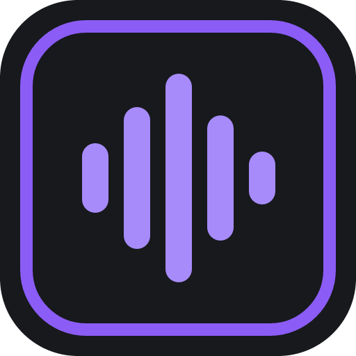
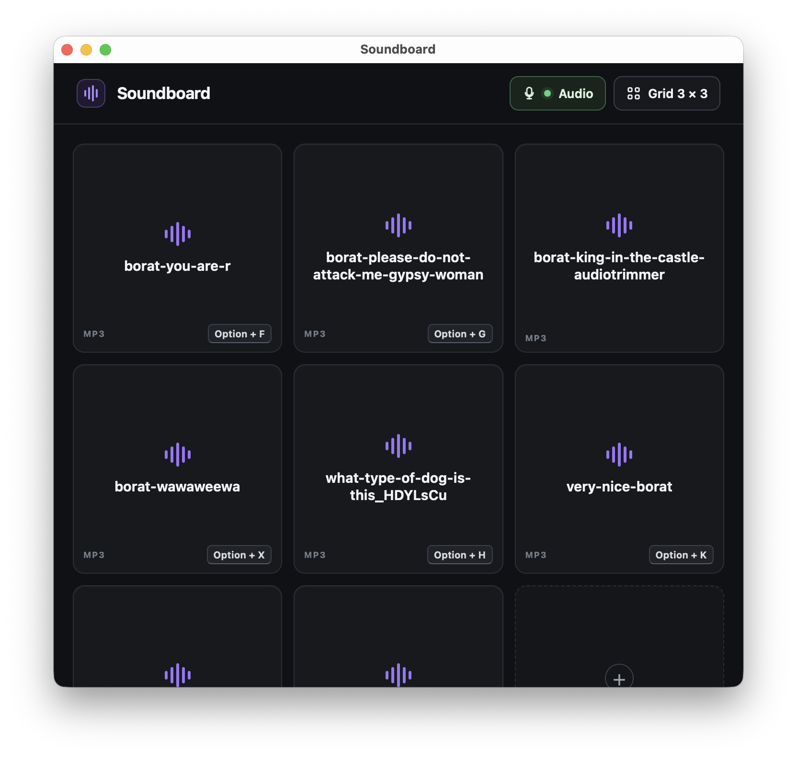

<p align="center">
  
</p>

<h1 align="center">Soundboard</h1>

<p align="center">
  A fast, local-first desktop soundboard with overlapping playback, global shortcuts, and optional virtual-microphone routing.
</p>

<p align="center">
  
</p>

## Download

[Download the latest release](../../releases/latest) from GitHub Releases:

- **macOS — Apple Silicon:** choose the `aarch64.dmg` asset.
- **macOS — Intel:** choose the `x86_64.dmg` asset.
- **Windows — 64-bit:** choose the `x86_64-setup.exe` asset.

The current installers are not signed with commercial Apple or Windows certificates. macOS Gatekeeper or Windows SmartScreen may therefore show a warning on first launch. See [Release signing](docs/RELEASING.md#release-signing) for details.

## Features

- Import MP3, WAV, OGG/Vorbis, and FLAC audio.
- Trigger sounds with a click, keyboard activation, or a system-wide shortcut.
- Start repeated, overlapping playback without cutting off earlier sounds.
- Combine your live microphone and soundboard clips in a virtual input for calls and streams.
- Adjust microphone/clip gain and optionally monitor clips through your normal output.
- Arrange sounds in a configurable grid from 1 × 1 to 12 × 12.
- Resize safely: sounds are compacted into empty cells and are never silently deleted.
- Replace or delete sounds and add, change, or remove shortcuts from each cell's context menu.
- Keep working offline with no account, analytics, telemetry, or cloud service.
- Preserve imported audio in app-managed storage, independent of the original file.

## Using Soundboard

1. Select an empty cell and choose an audio file.
2. Select a filled cell to play it.
3. Right-click a filled cell to change its sound, delete it, or manage its shortcut.
4. Select the grid-size control in the header to change rows and columns.

Global shortcuts remain active while Soundboard is running, even when its window is unfocused or minimized. Shortcut recording temporarily suspends existing shortcuts so assigning a key never plays another sound.

## Virtual microphone setup

Soundboard uses an existing virtual audio driver; it does not install or bundle one. Install the appropriate driver from its official source first:

- **macOS:** [BlackHole 2ch](https://existential.audio/blackhole/) (Homebrew: `brew install blackhole-2ch`)
- **Windows:** [VB-CABLE](https://vb-audio.com/Cable/) (run its installer as Administrator and reboot when requested)

Then configure routing:

1. Open **Audio** in the Soundboard header.
2. Choose the physical microphone that carries your voice.
3. Choose **BlackHole 2ch** on macOS or **CABLE Input** on Windows as the virtual output.
4. Adjust microphone and soundboard gain, choose whether to hear clips locally, and select **Start routing**.
5. In Discord, FaceTime, or another call app, select **BlackHole 2ch** on macOS or **CABLE Output** on Windows as the microphone.

Use headphones to prevent speaker feedback. If a call app cuts off or muffles clips, disable its noise suppression, echo cancellation, or automatic gain control. Soundboard targets the virtual device directly, so you do not need to change the operating system's default output.

The virtual drivers are maintained and licensed by their respective vendors. They are not part of the Soundboard installer.

## Development

### Prerequisites

- [Node.js 24](https://nodejs.org/) or another Node.js release supported by Vite 7
- [Rust 1.97.1](https://www.rust-lang.org/tools/install) (the repository toolchain file selects it)
- The [Tauri 2 platform prerequisites](https://v2.tauri.app/start/prerequisites/) for your operating system

### Run locally

```bash
npm ci
npm run tauri dev
```

Browser-only UI development uses an in-memory mock backend:

```bash
npm run dev
```

### Validate

```bash
npm run validate
cargo fmt --manifest-path src-tauri/Cargo.toml -- --check
cargo clippy --manifest-path src-tauri/Cargo.toml --all-targets --locked -- -D warnings
cargo test --manifest-path src-tauri/Cargo.toml --locked
```

### Build an installer locally

Run the command for your current operating system:

```bash
# macOS
npm run tauri -- build --bundles dmg

# Windows
npm run tauri -- build --bundles nsis
```

Cross-platform release installers are built automatically by GitHub Actions. The complete process is documented in [docs/RELEASING.md](docs/RELEASING.md).

## Architecture

- **UI:** Svelte 5, TypeScript, and Vite
- **Desktop runtime:** Tauri 2
- **Native core:** Rust
- **Audio:** Kira with CPAL
- **Virtual microphone:** CPAL microphone passthrough plus an external BlackHole/VB-CABLE device
- **Persistence:** crash-safe local JSON plus app-managed audio copies

The frontend/backend contracts and product decisions are captured in [soundboard-frontend-spec.md](soundboard-frontend-spec.md) and [soundboard-backend-spec.md](soundboard-backend-spec.md).

## Privacy

Soundboard stores its configuration and imported audio locally in the operating system's application-data directory. While routing is active, microphone samples pass through memory to the selected virtual output; they are never recorded or saved. Soundboard does not contain network calls, user accounts, analytics, or telemetry.
